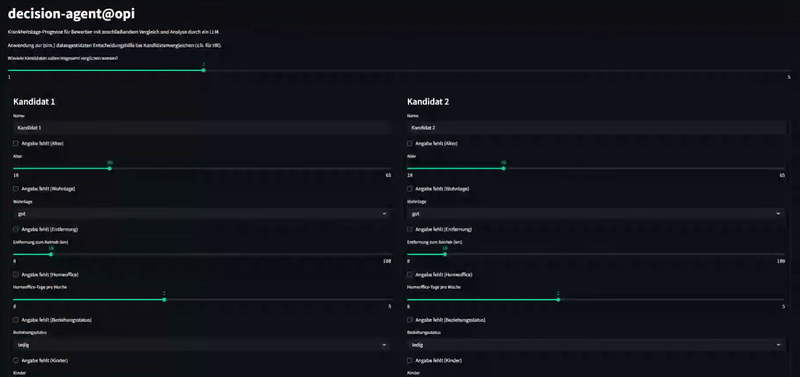
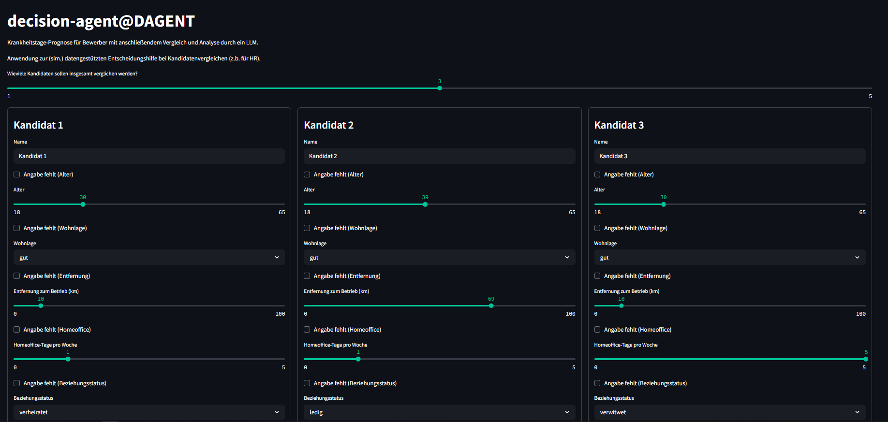
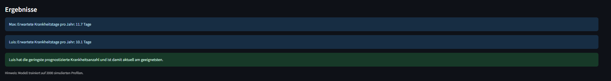
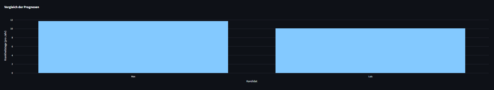
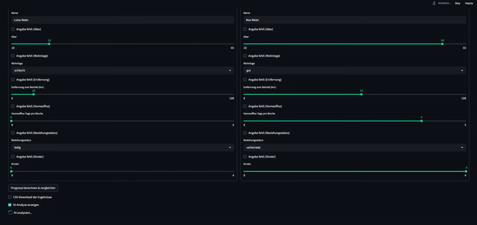
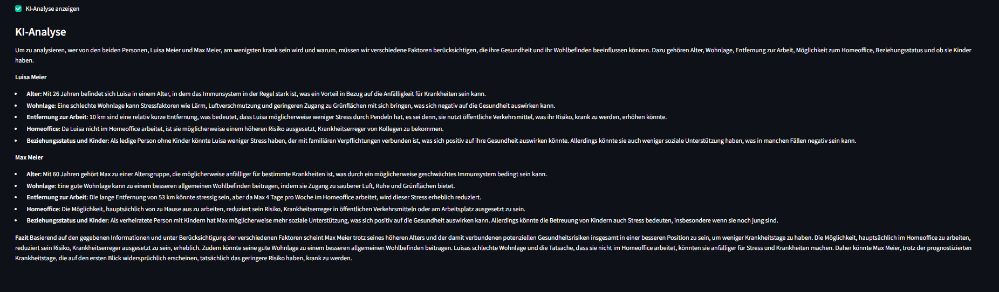
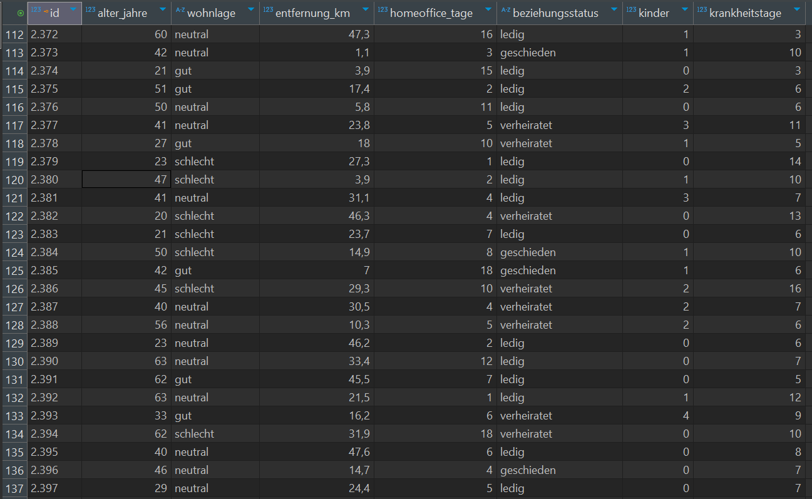

# decision-agent@DAGENT: Krankheitsprognose für Bewerber

<p align="center">
  
</p>



Dieses Projekt entstand aus der Idee, Bewerberprofile nicht nur anhand von Lebensläufen oder Gesprächen zu beurteilen, sondern auch mit Hilfe von Daten. Genauer gesagt:

Wie viele Krankheitstage könnten bei einer Person im Jahr voraussichtlich anfallen?

Ein trainiertes Machine-Learning-Modell (Random Forest Regressor) analysiert Angaben wie Alter, Wohnlage, Entfernung, Homeoffice-Tage, Familienstand und Kinder.

Trainiert wurde das Modell mit 2.000 simulierten Profilen. (Siehe abschnitt:Beispielhafte Trainingsdaten)

---



---

## Funktionen

- ML-Prognose: Erwartete Krankheitstage pro Kandidat berechnen  
  

- Plotly Visualisierung: Prognosevergleich im Balkendiagramm  
  

- CSV-Download: Prognosen als CSV-Datei speichern

- KI Analyse: gpt(-4-0125-preview)-gestützte Begründung der Ergebnisse aktivieren
  
  

- Fallback bei fehlenden Angaben:
  Für jedes Eingabefeld kann gewählt werden, ob es berücksichtigt werden soll. Falls ein Wert fehlt, wird automatisch ein realistischer Standard(-mittel)wert genutzt (z.B. Durchschnittsalter oder mittlere Entfernung)

---

## Wie es funktioniert

1. Anzahl der Kandidaten wählen (1–5), bei bedarf skalierbar

2. Angaben pro Kandidat eintragen:
   - Alter
   - Wohnlage (anhand rankings gut,mittel oder schlecht wählen)
   - Entfernung zum Arbeitsplatz (km)
   - Homeoffice-Tage (berechtigung/Woche)
   - Beziehungsstatus
   - Kinder

3. Auf „Prognose“ klicken

4. Ergebnisse, Diagramm und CSV optional anzeigen

5. KI-Analyse aktivieren (gpt-4-0125-preview), die Profile werden mit Begründung bewertet (optional)

---

## Beispielhafte Trainingsdaten

Ein Auszug aus der Datenbank, mit der das Modell trainiert wurde:



---

## Setup

```bash

#virtuelle Umgebung
python -m venv .venv

.venv\Scripts\activate     # für Windows

#req's
pip install -r requirements.txt

# start der app
streamlit run scripts/predict_app.py
